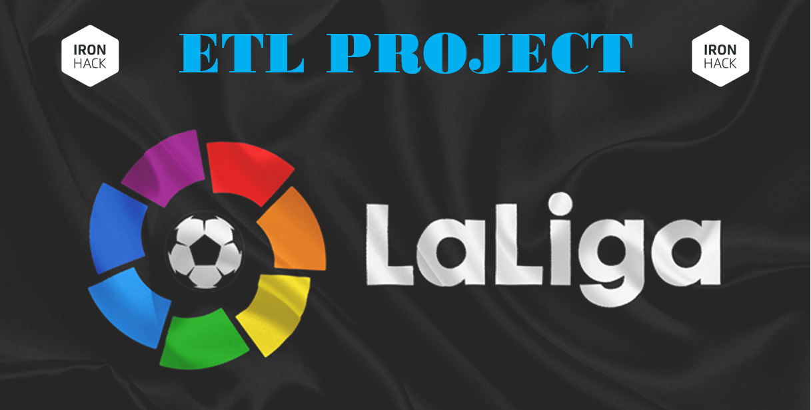

# ETL Project

El **objetivo** de este proyecto es completar un proceso ETL completo: extraer los datos, transformarlos y cargarlos en una base de datos.

## Etapa de Extracción.

Los datos son extraídos de 3 fuentes de datos:
    
- [Kaggel.](https://www.kaggle.com/thegreatcoder/laliga-player-stats)
- [ESPN.](https://www.espn.com/soccer/standings/_/league/ESP.1/season/2018)
- [Transfermarkt.](https://www.transfermarkt.com/laliga/startseite/wettbewerb/ES1/plus/?saison_id=2018)

Siguiendo 3 métodos de extracción direferentes:

- Archivo CSV.
- Web scrapping.
- Manejo de APIs.

Partimos de un archivo csv que contiene estadísticas de partido de todos los jugadores de La Liga durante la temporada 2018/2019. 

A partir de ahí, se enriquecen los datos mediante de la extracción de información acerca de los equipos de La Liga durante esta misma temporada. Esto se obtiene del contenido disponible en la página web de ESPN, un medio referente a nivel internacional. Los datos se extraerán mediante técnicas de web scrapping.

Para complementar lo anterior, extraeremos los datos referentes al valor de mercado de los jugadores de LaLiga durante el espacio temporal considerado anteriormente. Los datos serán extraídos mediante el manejo de APIs.

## Transformación de los datos.

Fundamentalmente se refiere a ajustes aplicados sobre los datos disponibles, para hacer posible su manejo y explotación en base al objetivo del proyecto.

Para ello haremos uso de objetos de pandas, con la gestión y limpieza de los datos a través de DataFrames como elemento fundamental.

## Creación de la base de datos.

Para completar el proceso, cargaremos las matrices generadas en una base de datos relacional. Utilizaremos MySQL para crear, estructurar y alimentar la base de datos, desarrollando todo el proceso mediante código en Python.

-------

### Tech stack.
- [Numpy](https://numpy.org/)
- [Pandas](https://pandas.pydata.org/)

- [Beautiful Soup](https://beautiful-soup-4.readthedocs.io/en/latest/#)
- [Requests](https://docs.python-requests.org/en/latest/#)
- [API](https://apify.com/petr_cermak/transfermarkt#features)